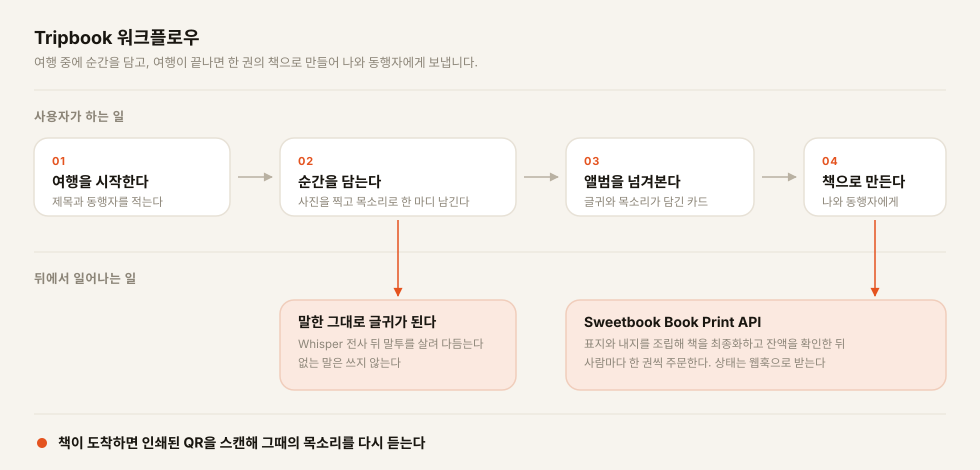

# Tripbook 📖

여행 사진과 **그때 내가 한 목소리 한 마디**가, 한 권의 책이 됩니다.

사진을 올리고 목소리로 그 순간을 말하면 Whisper가 글로 옮깁니다.
LLM은 말한 원문만 다듬어 캡션으로 남깁니다. 없는 말은 지어내지 않습니다.
다 담은 뒤 Sweetbook Book Print API로 실물 책을 주문해 나와 동행자에게 보냅니다.

> 이 레포는 서비스이자 연동 기록입니다.
> Book Print API를 외부 파트너 입장에서 붙여 실주문까지 완주했고, 막힌 지점을 문서로 남겼습니다.
> → [연동 피드백](docs/SWEETBOOK_API_FEEDBACK.md)

## 시그니처 — "종이책을 펼치면, 그때 내 목소리가 흘러나온다"

- 목소리가 담긴 순간은 인쇄면에 QR을 합성합니다. 스캔하면 그때 목소리가 재생됩니다.
- AI는 사용자의 말을 다듬기만 합니다. 없던 사실이나 감정을 보태지 않습니다.
- 여행 중에 사진과 목소리, 감정을 계속 담습니다. 여행이 끝나면 그대로 한 권이 됩니다.
- 같은 책을 동행자에게도 보낼 수 있습니다.

## Book Print API 연동 결과

| 단계 | 결과 |
|---|---|
| 책 렌더 `create → cover → contents → finalization` | ✅ 24p `isValid: true`. 순간이 판형 최소 페이지에 못 미치면 여백으로 채웁니다 |
| 주문 `POST /orders` | ✅ 실주문 완주 — `or_3oKrIwb1C5Ao`, `PDF_READY` |
| 충전금 차감 | ✅ 총액 15,327원, 부가세 10%를 더해 16,850원 차감 |
| 주문 취소·환불 `POST /orders/{uid}/cancel` | ✅ 제작 시작 전 전액 환불 |
| 웹훅 수신 | ⬜ 미등록. 공개 HTTPS 주소를 확보하면 `PUT /webhooks/config` |

## 워크플로우



## 기술 스택

| 영역 | 기술 |
|---|---|
| **Frontend** | React 19 · TypeScript · Vite · React Router · vitest |
| **Backend** | Python 3.11 · FastAPI · SQLAlchemy 2.0 · SQLite · BackgroundTasks · pytest |
| **AI** | OpenAI Whisper `whisper-1` 음성 인식 · gpt-4o-mini 캡션 편집과 이미지 감정 분류 |
| **외부 연동** | Sweetbook Book Print API TEMPLATE 방식 · Webhook HMAC-SHA256 서명 검증 · Idempotency-Key |
| **배포** | Render 정적 호스팅 · Tailscale Funnel 고정 도메인으로 로컬 백엔드 노출 |
| **그 외** | httpx · Pillow 리사이즈 · qrcode 인쇄면 QR 합성 |

## 무엇을 다뤘나

**Book Print API 연동**
판형 조회, 책 조립, 견적, 주문, 취소, 웹훅까지 전 구간을 붙였습니다.
결제성 API라 멱등 키를 요청 본문 해시로 생성해 이중 차감을 막습니다.
결제 직전에는 견적 API로 잔액을 사전 검증합니다.
충전금과 판형, 웹훅 등록을 다루는 운영 CLI도 따로 두었습니다.

**인쇄·제작·배송 공정**
주문 상태 11종의 전이를 그대로 따라갑니다.
웹훅은 HMAC 서명으로 검증하고, 재전송으로 순서가 뒤바뀌어도 상태를 되돌리지 않습니다.
웹훅 미등록 구간은 폴백 조회로 메우되, 호출량은 Rate Limit에 맞춰 30초로 묶었습니다.

**AI 파이프라인**
Whisper가 목소리를 글로 옮기고, 말투를 살려 캡션으로 다듬습니다.
편집이 실패하면 옮긴 원문을 그대로 남깁니다. 침묵하거나 지어내지 않습니다.

**모바일 웹 클라이언트**
React 19와 TypeScript로 만든 화면입니다.
서재에서 순간을 담고 앨범을 넘겨보다 책 주문까지 한 흐름으로 이어집니다.

## 실행 방법

### 백엔드

```bash
cd backend
pip install -r requirements.txt
cp ../.env.example .env
uvicorn app.main:app --reload --port 8273
```

`.env`는 실행 디렉터리 기준으로 읽으므로 `backend/.env`에 둡니다.
키는 `OPENAI_API_KEY`, `SWEETBOOK_API_KEY`, `SWEETBOOK_ENV`, `SWEETBOOK_WEBHOOK_SECRET`, `PUBLIC_WEB_BASE`입니다.

### 프론트엔드

```bash
cd frontend
npm install
VITE_API_BASE=http://localhost:8273 npm run dev -- --port 5273
```

### 데모 여행으로 바로 눌러보기

사진과 글귀, 감정, 재생 가능한 음성, 감정 아크, 주문 현황이 다 채워진 여행을 만듭니다.
AI 키나 Sweetbook 키가 없어도 전 화면을 눌러볼 수 있습니다.

```bash
cd backend; python scripts/seed_demo.py
```

출력된 주소에서 앨범과 순간 담기, 공개 재생 페이지를 열 수 있습니다.

판형과 템플릿 uid는 `backend/app/config.py`의 설정이 단일 출처입니다.
단가와 판형명은 `GET /book-specs`로 그때그때 받아오므로, 다른 판형을 쓰려면 설정 세 줄만 바꾸면 됩니다.

### 테스트

```bash
cd backend;  python -m pytest tests/ -v
cd frontend; npm test && npm run build
```

백엔드 테스트 63개는 외부 호출을 전부 모킹해 실키 없이 돕니다.
실키로 전 구간을 돌려보려면 서버를 띄운 뒤 `python scripts/demo_e2e.py`를 실행합니다.

### Sweetbook 운영·점검

실키가 필요합니다.

```bash
cd backend
python scripts/sweetbook_ops.py credits
python scripts/sweetbook_ops.py specs
python scripts/sweetbook_ops.py webhook register https://…/api/v1/webhooks/sweetbook
```

`transactions`, `charge`, `templates`, `books`, `order`, `cancel` 명령도 있습니다.

## 문서

| 문서 | 내용 |
|---|---|
| [`docs/CODE_TOUR.md`](docs/CODE_TOUR.md) | 처음 보는 사람이 읽는 순서대로 정리한 파일 지도 |
| [`docs/SWEETBOOK_API_FEEDBACK.md`](docs/SWEETBOOK_API_FEEDBACK.md) | 연동하며 겪은 것 |
| [`CLAUDE.md`](CLAUDE.md) | 스택과 테스트 명령, 코드 컨벤션 |
